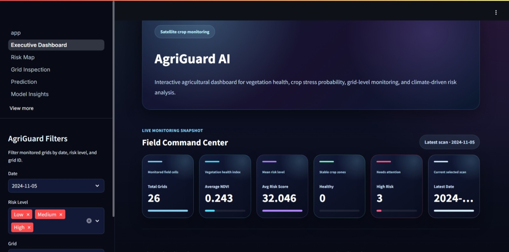
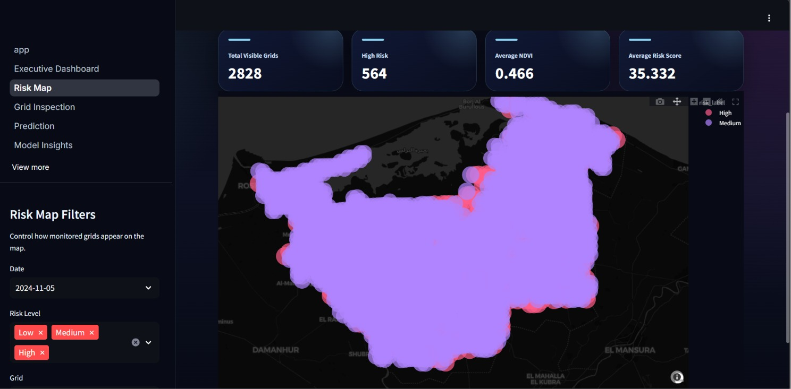
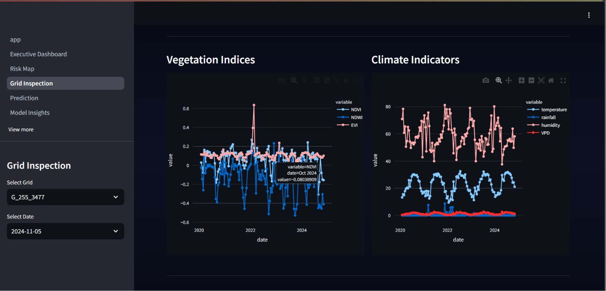
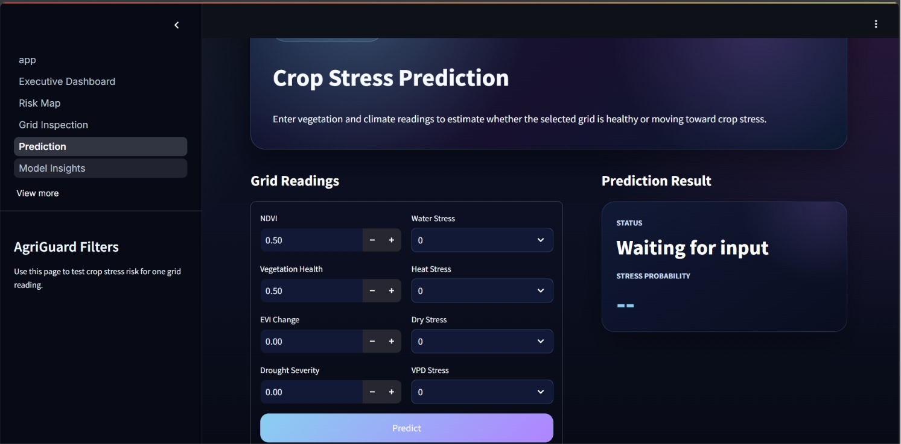
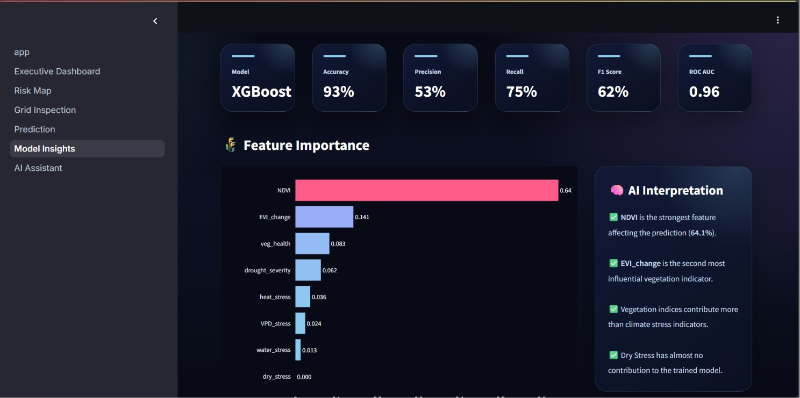

# 🌾 AgriGuard AI

[]()
[]()
[]()
[]()
[]()

An end-to-end AI-powered agricultural monitoring system for crop stress prediction using satellite imagery, climate data, and machine learning.

AgriGuard combines remote sensing, climate analytics, machine learning, interactive dashboards, and generative AI to help monitor agricultural fields and detect crop stress before severe damage occurs.

**🔗 [Live Demo](https://agriguard-frontend.wonderfulocean-04a2c7c9.uaenorth.azurecontainerapps.io)** · **📊 [Dataset on Kaggle](https://www.kaggle.com/datasets/mennaabukhadra/agriguard-ai)**

---

## 📑 Table of Contents

- [Overview](#overview)
- [Project Preview](#project-preview)
- [Main Features](#main-features)
- [System Architecture](#system-architecture)
- [Project Structure](#project-structure)
- [Technology Stack](#technology-stack)
- [Application Modules](#application-modules)
- [Dataset](#dataset)
- [Machine Learning Pipeline](#machine-learning-pipeline)
- [Model Performance](#model-performance)
- [Backend](#backend)
- [Frontend](#frontend)
- [AI Assistant](#ai-assistant)
- [Docker](#docker)
- [Cloud Deployment](#cloud-deployment)
- [MLOps](#mlops)
- [Installation](#installation)
- [Running Locally](#running-locally)
- [Environment Variables](#environment-variables)
- [Future Improvements](#future-improvements)
- [Team](#team)
- [License](#license)

---

## Overview

Agricultural monitoring has become increasingly important due to climate change, water scarcity, and environmental variability.

AgriGuard provides an intelligent platform capable of:

- Monitoring vegetation health
- Detecting crop stress
- Predicting future stress probability
- Visualizing agricultural grids on interactive maps
- Explaining predictions using AI
- Providing field recommendations for farmers

The project follows an end-to-end machine learning workflow starting from data collection and preprocessing through deployment and MLOps.

---
## Project Preview

### Executive Dashboard


### Risk Map


### Grid Inspection


### Prediction


### Model Insights


### AI Assistant

---

## Main Features

- Satellite-based crop monitoring
- Climate-aware crop stress prediction
- XGBoost machine learning model
- Explainable AI visualizations
- Interactive geospatial risk mapping
- Grid-level inspection dashboard
- AI Assistant powered by Gemini
- FastAPI backend
- Streamlit frontend
- Dockerized deployment
- Azure cloud deployment
- GitHub Actions CI/CD pipeline

---

## System Architecture

Satellite & Climate Data
                              │
                              ▼
                    Data Preprocessing
                              │
                              ▼
                    Feature Engineering
                              │
                              ▼
                      XGBoost Classifier
                              │
                ┌─────────────┴─────────────┐
                │                           │
                ▼                           ▼
          FastAPI Backend             Gemini API
                │                           │
                └─────────────┬─────────────┘
                              │
                              ▼
                     Streamlit Frontend
                     
The backend acts as the communication layer between the machine learning model, datasets, AI assistant, and the user interface.

---

## Project Structure

```text
AgriGuard-AI/
│
├── backend/
│   ├── services/
│   ├── saved_models/
│   ├── schemas.py
│   ├── main.py
│   ├── requirements.txt
│   └── Dockerfile
│
├── frontend/
│   ├── pages/
│   ├── utils/
│   ├── app.py
│   ├── requirements.txt
│   └── Dockerfile
│
├── notebooks/
├── docs/
│   └── images/
├── .github/
│   └── workflows/
│
├── .env.example
├── docker-compose.yml
├── README.md
└── .gitignore
```

---

## Technology Stack

| Category | Technologies |
|----------|--------------|
| Machine Learning | XGBoost, Scikit-learn, Pandas |
| Backend | FastAPI |
| Frontend | Streamlit |
| AI | Gemini |
| Cloud | Azure |
| Deployment | Docker |

---

## Application Modules

### Executive Dashboard
Provides an overall view of the monitored agricultural fields, including total monitored grids, average vegetation health, average risk score, high-risk fields, interactive charts, and live monitoring statistics.

### Risk Map
Displays all monitored agricultural grids on an interactive map. Users can filter by date, filter by risk level, select individual grids, and explore spatial crop stress distribution.

### Grid Inspection
Provides a detailed analysis for a selected agricultural grid, including NDVI, NDWI, EVI, vegetation health, climate indicators, historical trends, and risk score.

### Crop Stress Prediction
Allows users to manually enter field measurements. The system predicts crop health status, stress probability, and risk level using the trained XGBoost model.

### Model Insights
Provides model performance metrics, feature importance, explainability, and interpretation.

### AI Assistant
Allows users to ask agricultural questions related to a specific field. The assistant combines the user question, field measurements, and XGBoost prediction before generating an explanation and recommendations using Gemini. **The prediction itself always comes from the trained machine learning model — Gemini only explains it.**

---

## Dataset

The project is built using a dataset that combines satellite observations with climate measurements to monitor crop health and predict agricultural stress. It contains vegetation indices, environmental variables, and engineered features representing crop conditions over time.

📊 **[Kaggle Dataset](https://www.kaggle.com/datasets/mennaabukhadra/agriguard-ai)**

### Data Preparation

- Handling missing values
- Removing duplicated records
- Converting data types
- Feature scaling
- Label preparation
- Feature selection
- Data validation

### Feature Engineering

| Category | Features |
|----------|----------|
| Vegetation | NDVI, NDVI Rolling Mean, NDVI Rolling Std, NDVI Lag, NDVI Change, Vegetation Health |
| Water | NDWI, Water Stress |
| Temperature | Heat Stress |
| Atmospheric | VPD Stress |
| Drought | Dry Stress, Drought Severity |
| Temporal | Month, Day of Year, Season |
| Climate | Temperature, Rainfall, Humidity, VPD |

---

## Machine Learning Pipeline

Several machine learning models were evaluated during experimentation. The final deployed model is based on **XGBoost**, selected because it achieved the best overall performance for crop stress prediction.

### Input Features

`NDVI` · `Vegetation Health` · `EVI Change` · `Water Stress` · `Heat Stress` · `Dry Stress` · `VPD Stress` · `Drought Severity`

### Model Output

For each prediction, the model returns: Prediction, Stress Probability, Risk Level, Crop Status.

---

## Model Performance

| Metric | Score |
|--------|-------|
| Accuracy | `93%` |
| Precision | `53%` |
| Recall | `75%` |
| F1 Score | `62%` |
| ROC AUC | `0.96` |

The **Model Insights** page also provides feature importance visualization and interpretation of the most influential variables, helping users understand predictions instead of treating the model as a black box.

---

## Backend

Built using **FastAPI** to separate application logic from the UI and provide a scalable, API-driven architecture. All requests go through the backend instead of the frontend talking directly to the model or datasets.

**Responsibilities:** serving REST APIs, loading the trained XGBoost model, validating input via Pydantic, preparing inference data, returning predictions, and managing communication with Gemini.

### API Endpoints

| Endpoint | Description |
|----------|-------------|
| `/dashboard` | Executive Dashboard statistics |
| `/risk-map` | Geospatial monitoring data |
| `/grid-inspection` | Field-level information |
| `/predict` | Crop stress prediction |
| `/model-insights` | Model evaluation metrics |
| `/chat` | AI Assistant endpoint |

> Interactive API docs are available at `/docs` (Swagger UI) once the backend is running.

---

## Frontend

Built using **Streamlit**, communicating with the backend exclusively through REST APIs. Includes six main pages: Executive Dashboard, Risk Map, Grid Inspection, Crop Stress Prediction, Model Insights, and AI Assistant.

---

## AI Assistant

1. User submits a question through Streamlit.
2. FastAPI receives the request and prepares current field measurements.
3. The trained XGBoost model generates a prediction.
4. FastAPI builds a prompt containing the question, measurements, prediction, and risk level.
5. The prompt is sent to the Gemini API.
6. Gemini generates an explanation and practical recommendations.
7. The response is returned to the frontend.

---

## Docker

The application is fully containerized with separate Dockerfiles for backend and frontend, orchestrated via Docker Compose.

```bash
docker compose build
docker compose up
```

Environment variables are used instead of hardcoded API URLs, so the frontend reads the backend address dynamically.

---

## Cloud Deployment

Deployed to **Microsoft Azure** using containerized services for consistency between development and production.

---
**Deployment steps:** build Docker images → push to Azure Container Registry → deploy backend/frontend as separate Container Apps → configure environment variables → connect frontend to backend → verify all modules.

---

## MLOps

| Practice | Tool |
|----------|------|
| Version Control | Git & GitHub |
| Containerization | Docker |
| CI/CD | GitHub Actions |
| Image Registry | Azure Container Registry |

GitHub Actions automates deployment — every push updates the live application on Azure automatically, reducing manual steps.

---

## Installation

### Prerequisites
- Python 3.10+
- Docker & Docker Compose
- Git

### Clone the Repository

```bash
git clone https://github.com/MennaAbukhadra/AgriGuard-AI.git
cd AgriGuard-AI
```

### Create a Virtual Environment

```bash
python -m venv .venv
```

**Windows**
```bash
.venv\Scripts\activate
```

**Linux / macOS**
```bash
source .venv/bin/activate
```

### Install Dependencies

```bash
pip install -r backend/requirements.txt
pip install -r frontend/requirements.txt
```

---

## Running Locally

```bash
# Start the backend
uvicorn main:app --reload --port 8010

# Start the frontend
streamlit run app.py
```

## Running with Docker

```bash
docker compose build
docker compose up
```

---

## Environment Variables

Create a `.env` file based on `.env.example`:

```env
BACKEND_URL=http://localhost:8010
GEMINI_API_KEY=your_gemini_api_key_here
```

---

## Future Improvements

- Real-time satellite image integration
- Automatic model retraining using newly collected data
- Support for additional crop types
- Mobile application for field monitoring
- Weather forecast integration
- Early warning notification system
- Continuous monitoring using scheduled pipelines
- Model versioning and experiment tracking using MLflow

---

## License

Developed as part of the **Digital Egypt Pioneers Initiative (DEPI)**, for educational and research purposes.

---

## Acknowledgments

Thanks to the Digital Egypt Pioneers Initiative (DEPI), mentors, instructors, and everyone who contributed to this project.
